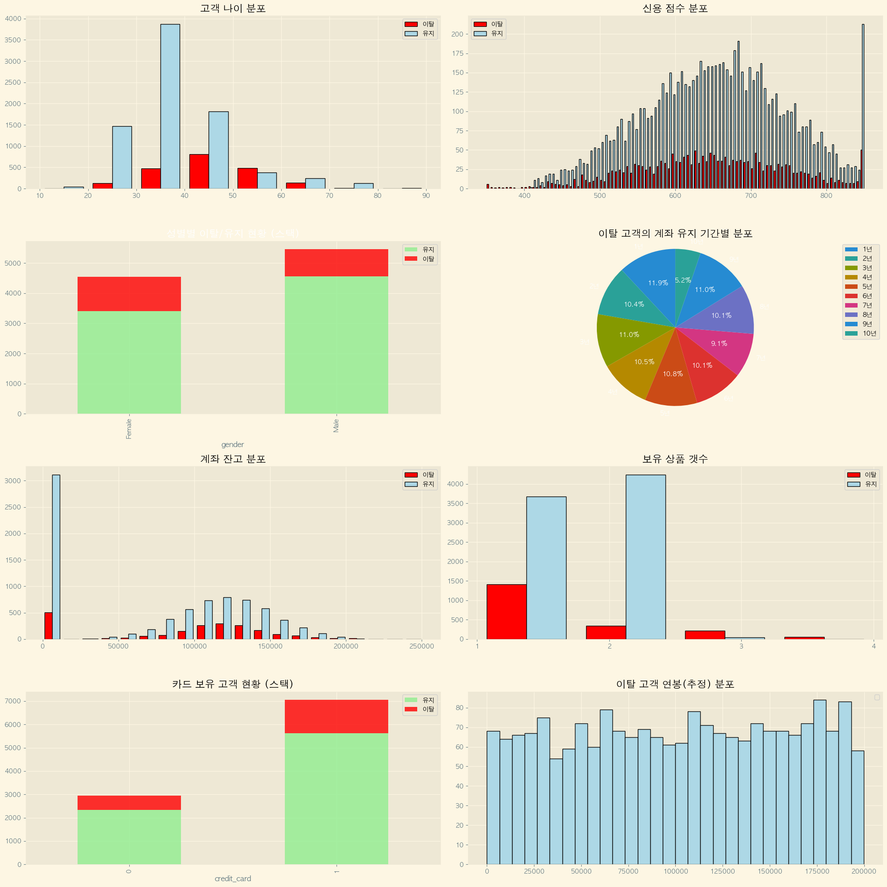
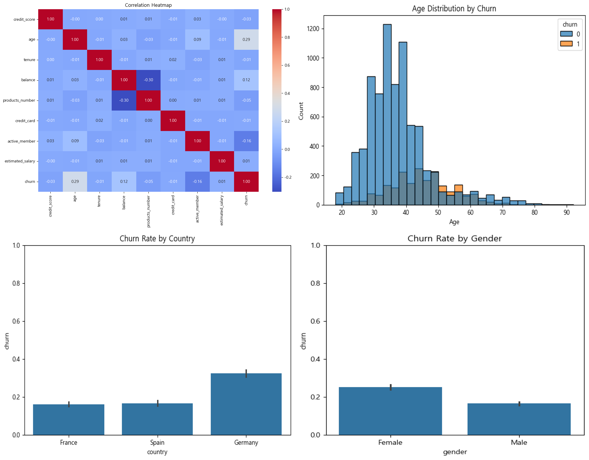

# 은행 고객 이탈 예측 분석

___
## 📌 주제 선정 이유 및 프로젝트 목표

### 프로젝트 배경
은행 산업에서 고객 이탈은 수익성에 직접적인 영향을 미치는 중요한 과제입니다.  
신규 고객 유치 비용이 기존 고객 유지 비용보다 5배 이상 높다는 점을 고려할 때,  
**이탈 가능성이 높은 고객을 사전에 식별하고 선제적으로 대응**하는 것이 필수적입니다.

### 프로젝트 목표
본 프로젝트는 머신러닝 기반의 고객 이탈 예측 모델을 구축하여  
**데이터 기반의 고객 유지 전략 수립**을 지원하는 것을 목표로 합니다.

#### 성능 목표
- **Recall ≥ 0.7**: 실제 이탈 고객을 놓치지 않고 최대한 포착
- **Precision ≥ 0.5**: 과도한 False Positive를 방지하여 효율적인 리소스 배분

> 💡 Recall을 우선시하는 이유: 이탈 고객을 놓치는 것(False Negative)이  
> 비이탈 고객을 이탈로 예측하는 것(False Positive)보다 비즈니스 손실이 크기 때문

### 🔄 프로젝트 진행 방식
- 모든 팀원이 데이터 전처리부터 모델링까지 **전 과정을 독립적으로 수행**
- 다양한 알고리즘과 접근법을 시도하여 최적의 모델 탐색
- 최종적으로 가장 높은 성능을 보이는 모델을 선정  
---

## 👥 팀 구성 및 담당 업무

| 이름 | 담당업무 |
|------|-------------|
| 정덕규 |   |
| 김가람 |   |
| 강현욱 |   |
| 박내은 |   |
| 장이선 |   |

---

## 📈 데이터셋 상세 설명
- customer_id: 계좌 id
- credit_score: 신용 점수
- country: 거주 도시
- gender: 성별
- age: 나이
- tenure: 계좌 보유 기간(단위: 년)
- balance: 계좌 잔고
- products_number: 보유 상품 갯수
- credit_card: 신용카드 보유 여부
- active_member: 활성 고객 여부
- estimated_salary: 연봉 정보 (추정)
- churn: 이탈 여부
#### 📚 출처 [Bank Customer Churn Dataset](https://www.kaggle.com/datasets/gauravtopre/bank-customer-churn-dataset/data)
___

## 📊 Exploratory Data Analysis (EDA)

___
## 최종 선정 모델

추후 업데이트 예정....

---

## ⚙️ Tech Stack  
         
         

___

## 🗨 회고록  

| 이름 | 회고                                                                                                                                                                                       |
|------|------------------------------------------------------------------------------------------------------------------------------------------------------------------------------------------|
| 정덕규 | 데이터의 전처리부터 하이퍼파라미터 튜닝, 원하는 모델을 설정하여 예측하기까지 일련의 과정을 거치면서 고객의 입장에서 어떠한 요구가 필요한지 체감하게 되었습니다. 다양한 신경망을 학습하여 결과를 예측하고 싶었지만 기본적인 머신러닝 프로젝트를 경험하면서 어떤 모델을 수립해야 원하는 값을 도출할 수 있는지 체득할 수 있었습니다. :D |
| 김가람 |                                                                                                                                                                                          |
| 강현욱 | 전처리, EDA, 임계값 조정의 영향력을 직접 검증하며, 모델 성능 최적화 과정의 핵심 기술들을 체계적으로 이해한 의미 있는 프로젝트였습니다.                                                                                                          |
| 박내은 | 해당 프로젝트를 진행하면서 Feature enginering의 중요성도 깨달았고, EDA의 분석으로 시각화의 목적도 이해되었습니다. 다양한 모델의 하이퍼 파라미터를 찾아보면서 모델의 구조에 전보단 가까워 진 것 같...아요(아마도) 모든 과정을 진행해 볼 수 있어서 많은 경험이 된 프로젝트 였습니다. :)              |
| 장이선 | 모델 전처리부터 EDA, Feature Engineering, 모델 선정과 성능 최적화까지 전 과정을 직접 해보면서, 그동안 수업을 들을 때는 몰랐던 흐름과 원리를 몸으로 이해할 수 있었습니다! 단순히 코드를 실행하는 수준이 아니라, 어떤 단계에서 내가 부족했는지 스스로 깨닫게 된 점이 특히 의미 있었다고 생각합니다. 처음부터 끝까지 시행착오를 겪으며 완성해낸 경험이 나를 한 단계 성장시켰다는 확신이 들었고, 그 과정 자체가 무척 뿌듯하게 느껴집니다!!! （￣︶￣）↗　 |
